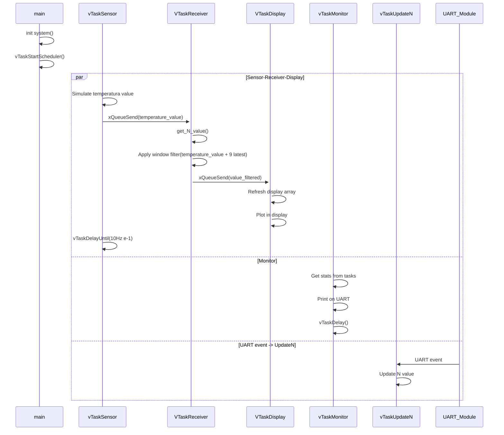

# FreeRTOS - Sistemas Operativos II - FCEFyN


## Descripción general
Firmware para **LM3S811(ARM CORTEX M3)**, utilizando FreeRTOS para su desarrollo y QEMU para su simulación.


## Objetivo
El firmware debe contemplar las siguientes tareas y requerimientos:
- Simular n sensor de temperatura que tome valores a 10 Hz.
- Receptor de los datos del sensor, que los filtre con un filtro de ventana deslizante. Su valor "N" que define la ventana, debe ser recibido mediante UART.
- Mostrar en el display la señal a la salida del filtro.
- Monitor para observar el estado de todas las tareas. 

## Desarrollo


### Tools
- FreeRTOS: Sistema operativo en tiempo real ampliamente usado en microcontroladores y pequeños microprocesadores.
- QEMU: Emulador que permite virtualizar programas compilados en un entorno diferente a la principal.

### vTaskSensor
Esta tarea simula el sensor cada 10 hertz. Para hacer una señal distinguible en el display, usa un contador de una temperatura mínima a máxima definible por parámetros. 

Para el tiempo usamos vTaskDelayUntil() con 100 mS. Además se agregan definiciones que facilitan el debug y la presentación (como delays más bajos y asi observar prints y detalles lentamente). 

Una vez "simulado" el valor del sensor, se envía a la tarea del receptor mediante la xSensorQueue.

```c
void vTaskSensor(void* pvParameters)
{
    (void)pvParameters;
    // Simulate a function that reaches 20 and returns to zero, so the "sensor" measurement varies
    int temperature_v = MIN_TEMPERATURE;

    // Enable 2 modes to see it at 10 hertz or slower with prints
    TickType_t xLastWakeTime = xTaskGetTickCount();
#if SENSOR_10HZ
    const TickType_t xFrequency = pdMS_TO_TICKS(100);
#else
    const TickType_t xFrequency = pdMS_TO_TICKS(3000);
#endif

    for (;;)
    {
        if (temperature_v < MAX_TEMPERATURE)
        {
            temperature_v++;
        }
        else
        {
            temperature_v = MIN_TEMPERATURE;
        }
        xQueueSend(xSensorQueue, &temperature_v, portMAX_DELAY); // Send it to the filter

#if SENSOR_10HZ
        vTaskDelayUntil(&xLastWakeTime, xFrequency);
#else
        char buffer[DEFAULT_SIZE_BUFFERS];
        vIntToString(temperature_v, buffer); // Convert integer to string
        sendUART("\n[INFO] | TaskSensor | Temperature: ");
        sendUART(buffer);
        sendUART("ºC");
        vTaskDelayUntil(&xLastWakeTime, xFrequency);
#endif
    }
}

```
### VTaskReceiverDataSensor

En esta tarea atendemos el valor del sensor para aplicarle el filtro de la ventana. En resumen, queda escuchando en la cola los valores que entran, se guardan en un arreglo para hacerlo sobre los ultimos 10 valores y se aplcia la logica del filtro de la ventana, el cual es promediarlo segun N muestras.

```c

void vTaskReceiverDataSensor(void* pvParameters)
{
    (void)pvParameters;

    int values[MAX_VALUES_AVERAGE] = {0};
    int value;
    int filter;
    int N;
    char buffer[DEFAULT_SIZE_BUFFERS];
    N = get_N_value();
    vIntToString(N, buffer);
    sendUART("\n[INFO] | TaskReceiverDataSensor | N initial: ");
    sendUART(buffer);

    for (;;)
    {
        xQueueReceive(xSensorQueue, &value, portMAX_DELAY);
        // Shift values back in the buffer
        for (int i = MAX_VALUES_AVERAGE - 1; i > 0; i--)
        {
            values[i] = values[i - 1];
        }
        values[0] = value; // Store the new value in the first position

        // Apply window filter (sum the N values and average)
        filter = 0;
        N = get_N_value();

        if (N < 0)
        {
            N = 1;
        }
        else if (N > MAX_VALUES_AVERAGE)
        {
            N = MAX_VALUES_AVERAGE;
        }

        for (int i = 0; i < N; i++)
        {
            filter += values[i];
        }

        filter = filter / N;
#if SENSOR_10HZ
        xQueueSend(xDisplayQueue, &filter, portMAX_DELAY);
#else
        vIntToString(N, buffer);
        sendUART("\n[INFO] | TaskReceiverDataSensor | Value filtered: ");
        sendUART(buffer);
        xQueueSend(xDisplayQueue, &filter, portMAX_DELAY);
#endif
    }
}

```

### VTaskDisplay
Esta es la tarea que recibe el valor filtrado. Simplemente tiene una splash screen al principio y luego se encarga de mapear el valor a bit del display, en nuestro caso, de 96x16 cuadros. Para realizarlo se tiene un buffer circular para ir desplazando la onda de izquierda a derecha y usando la funcion bitMapping, mapeamos el valor normalizado al bit correspondiente 

```c

void vTaskDisplay(void* pvParameters)
{
    (void)pvParameters;

    int value_filter;
    static int buffer_onda[96] = {0};
    int i;

    OSRAMStringDraw("FreeRTOS - SO2", 0, 0);
    vTaskDelay(500);
    OSRAMClear();
    vTaskDelay(500);

    OSRAMStringDraw("FreeRTOS - SO2", 0, 0);
    vTaskDelay(500);
    OSRAMClear();
    vTaskDelay(500);

    OSRAMStringDraw("FreeRTOS - SO2", 0, 0);
    vTaskDelay(500);
    OSRAMClear();
    vTaskDelay(500);

    OSRAMStringDraw("FreeRTOS - SO2", 0, 0);
    vTaskDelay(2000);
    OSRAMClear();

    for (;;)
    {
        xQueueReceive(xDisplayQueue, &value_filter, portMAX_DELAY);

        // Add new value
        for (i = 95; i > 0; i--)
        {
            buffer_onda[i] = buffer_onda[i - 1];
        }
        buffer_onda[0] = value_filter;

        OSRAMClear();

        // Normalization
        for (i = 0; i < 96; i++)
        {
            int input = buffer_onda[i];

            // 0 - 20 (default range)
            if (input < DISPLAY_MIN_INPUT)
                input = DISPLAY_MIN_INPUT;
            if (input > DISPLAY_MAX_INPUT)
                input = DISPLAY_MAX_INPUT;

            // map from [0 - 20] to [0 - 14]
            int total_steps = 2 * BITMAP_HALF_SIZE;
            int mapped_continuous = (input - DISPLAY_MIN_INPUT) * total_steps / (DISPLAY_MAX_INPUT - DISPLAY_MIN_INPUT);

            int bit_map_half, mapped;
            if (mapped_continuous < BITMAP_HALF_SIZE)
            {
                bit_map_half = 1;           // down
                mapped = mapped_continuous; // 0-7
            }
            else
            {
                bit_map_half = 0;                              // up
                mapped = mapped_continuous - BITMAP_HALF_SIZE; // 0-6
            }

            OSRAMImageDraw((const unsigned char*)bitMapping(mapped), i, bit_map_half, 1, 1); // draw
        }

#if !SENSOR_10HZ
        char buffer[DEFAULT_SIZE_BUFFERS];
        vIntToString(value_filter, buffer);
        sendUART("\n[INFO] | TaskDisplay | Filtered value: ");
        sendUART(buffer);
#endif
    }
}
```


### vTaskUpdateN

Esta tarea se encarga de actualizar el valor N cuando se lo ordena por UART. Un posible fix podría ser tratarlo desde la ISR directamente y ahorrarnos una tarea. 

```C
void vTaskUpdateN(void *pvParameters){
    (void) pvParameters; 
    char buffer[50];
    int N ;
    for ( ; ; ){
        if (xQueueReceive(xUpdateNQueue, &N, portMAX_DELAY) == pdTRUE){
            valor_ventana = N;
            vIntToString(N, buffer);
            sendUART("\n[INFO] | TaskUpdateN | N: ");
            sendUART(buffer);
        }
    }
}
```


### vTaskMonitor 
Permite obtener y mostrar información detallada de todas las tareas en ejecución en el sistema.


 - uxTaskGetNumberOfTasks() Esto devuelve la cantidad de tareas actualmente creadas en el sistema.

- uxTaskGetSystemState(pxTaskStatusArray, uxArraySize, &ulTotalRunTime): array de TaskStatus_t donde se almacenan los datos. Cada TaskStatus_t contiene NOMBRE, PRIORIDAD, ESTADO, STACK LIBRE MAXIMO, NUMERO.

Simplemente una vez obtenida la infomarción lo imprimimos por uart.
```c

void vTaskMonitor(void* pvParameters)
{
    (void)pvParameters;

    char buffer_string[DEFAULT_SIZE_BUFFERS];
    TaskStatus_t *pxTaskStatusArray;
    UBaseType_t uxArraySize, uxTasksReturned;
    uint32_t ulTotalRunTime;

    // get number tasks
    uxArraySize = uxTaskGetNumberOfTasks();

    // reserve memory for array
    pxTaskStatusArray = pvPortMalloc(uxArraySize * sizeof(TaskStatus_t));
    if (pxTaskStatusArray == NULL) vTaskDelete(NULL);
    while (1)
    {
        if (pxTaskStatusArray != NULL)
        {
            // Get the task states
            uxTasksReturned = uxTaskGetSystemState(pxTaskStatusArray, MAX_TASKS, &ulTotalRunTime);

            sendUART("\n\n[INFO] | vTaskMonitor | System Task Statistics:\n");
            sendUART("==============================================\n");

            // Iterate through all tasks
            for (UBaseType_t i = 0; i < uxTasksReturned; i++)
            {
                sendUART("\nTask: ");
                sendUART(pxTaskStatusArray[i].pcTaskName);

                sendUART("\n  Priority: ");
                vIntToString(pxTaskStatusArray[i].uxCurrentPriority, buffer_string);
                sendUART(buffer_string);

                sendUART("\n  State: ");
                sendUART(getStateName(pxTaskStatusArray[i].eCurrentState));

                sendUART("\n  Stack Free: ");
                vIntToString(pxTaskStatusArray[i].usStackHighWaterMark, buffer_string);
                sendUART(buffer_string);
                sendUART(" words");

                sendUART("\n  Task Number: ");
                vIntToString(pxTaskStatusArray[i].xTaskNumber, buffer_string);
                sendUART(buffer_string);

                sendUART("\n  ----------------------------------------");
            }

            sendUART("\n\nTotal Tasks: ");
            vIntToString(uxTasksReturned, buffer_string);
            sendUART(buffer_string);
            sendUART("\n");

            // Free the memory after use
            vPortFree(pxTaskStatusArray);
        }
        else
        {
            sendUART("\n[ERROR] | vTaskMonitor | Memory allocation failed\n");
        }

        // wait
        vTaskDelay(10000);
    }
}
```

## Ejecución 

```bash
#build
make clean
make

#run
qemu-system-arm -M lm3s811evb -kernel gcc/RTOSDemo.axf -serial stdio
```

Para debug simplemente corremos

`qemu-system-arm -M lm3s811evb -kernel gcc/RTOSDemo.axf -S -s -serial stdio`

y desde otra terminal 
`arm-none-eabi-gdb gcc/RTOSDemo.axf `
ó
```bash
 gdb-multiarch gcc/RTOSDemo.axf
(gdb) target remote :1234
```

## FreeRTOS docs used
```c
xTaskCreate(
                    vTaskCode,       /* Function that implements the task. */
                    "NAME",          /* Text name for the task. */
                    STACK_SIZE,      /* Stack size in words, not bytes. */
                    ( void * ) 1,    /* Parameter passed into the task. */
                    tskIDLE_PRIORITY,/* Priority at which the task is created. */
                    &xHandle );      /* Used to pass out the created task's handle. */

 QueueHandle_t xQueueCreate( UBaseType_t uxQueueLength,
                             UBaseType_t uxItemSize );

volatile TickType_t xTaskGetTickCount( void ); 

void vTaskDelayUntil( TickType_t *pxPreviousWakeTime,
                      const TickType_t xTimeIncrement );
void vTaskDelay( const TickType_t xTicksToDelay );

UBaseType_t uxTaskGetNumberOfTasks( void ); //Number of task from system

UBaseType_t uxTaskGetSystemState( TaskStatus_t * const pxTaskStatusArray,
                                  const UBaseType_t uxArraySize,
                                  uint32_t * const pulTotalRunTime );
    // Complete array with TaskStatus_t and info from each task
    // pulTotalRunTime total CPU
```


